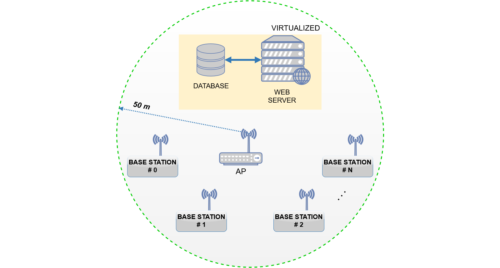

# Indoor Environmental Quality Analyzer (IEQA)

The I.E.Q.A. system consists of spatially distributed autonomous base stations equipped with sensors, LCD display, actuator, data storage device and a board that supports a Linux distribution with built-in WiFi support.
Every single base station is able to send their acquired/stored data over WiFi in a Wireless Local Area Network (WLAN) to a virtual Linux server which is aimed to process and display data through a dedicated web application. The latter, processes the data using a mathematical model based on the combination of two parameters: Heat Index (HI), which is obtained by multiple regression analysis by considering the values of temperature and relative humidity, and the Luminosity-Brightness Index (LBI) that provides an index based on the detected brightness according to [UNI EN 12464](http://store.uni.com/magento-1.4.0.1/index.php/uni-en-12464-1-2011.html) (released by the [Italian National Unification](http://www.uni.com)).

    </img>

For more details explore the following sections:

- [Main features](#main-features)
- [Network](#network)
- [Hardware](#hardware)
- [Firmware](./code/firmware)
- [Web application](./code/webapp)

## Main features

### Server

* _Dashboard_: shows in real time the relevant data using charts and tables to illustrate the most important informations;
* _Graphs_: shows in real time detailed graphs in order to analyze data;
* _Statistics_: shows in real time statistics, boxplots and graphs to make statistical analysis of data;
* _Report_: uses the processed data to print statistical report;
* _Options_: allows to edit/apply various option (see functionalities for the user).

### User

* _Empty the table_: allows to truncate through a SQL query of the database table which contains the all acquired values;
* _Set the sampling rate_: allows to set the time interval between two consecutive acquisitions on the desired base station/s;
* _Set the alarm thresholds_: allows to set the alarm thresholds for each sensor (e.g., temperature, relative humidity, and brightness/luminosity) on the desired base station/s.

### Base station

* _Connection_: each BS is able to automatically connect to the WLAN network with a static IP;
* _Time synchronization_: the device can synchronize its clock time with the server;
* _Storage device_: in offline mode the acquired data are stored into a microSD card. Then, as soon as the connection has been re-established, the saved data will be automatically sent to the server;
* _Programmable_: it is possible to edit the firmware code setting different alarm thresholds and sampling rate directly from the server;
* _Actuator_: each BS has been predisposed to easily drive an actuator;
* _Self-diagnostic_: the device can easily identify when a fault has occurred.
* _LCD and Reset_: each BS has endowed with a reset button and a display with backlight that shows all informations about the system.

## Network

### Network configuration
The following table illustrates an example of network configuration of the whole system implemented using two base stations.

|               |      BS #0      |      BS #1      |       Host      |   Virtual web   |
|---------------|:---------------:|:---------------:|:---------------:|:---------------:|
| Address       |  192.168.43.10  |  192.168.43.20  |  192.168.43.61  |  192.168.43.100 |
| Netmask       |  255.255.255.0  |  255.255.255.0  |  255.255.255.0  |  255.255.255.0  |
| Wildcard mask |    0.0.0.255    |    0.0.0.255    |    0.0.0.255    |    0.0.0.255    |
| Network       | 192.168.43.0/24 | 192.168.43.0/24 | 192.168.43.0/24 | 192.168.43.0/24 |
| Broadcast     |  192.168.43.255 |  192.168.43.255 |  192.168.43.255 |  192.168.43.255 |
| Gateway       |   192.168.43.1  |   192.168.43.1  |   192.168.43.1  |   192.168.43.1  |

    </img>

In this case, the system is composed of 4 hosts, leaving space for another 249 hosts.

**NOTE**:  in order to allow the _handover_ between nodes (or devices) and WLAN, it is possible to use multiple access points (APs).

## License

This project is licensed under the MIT License - see the [LICENSE](LICENSE) file for details.
