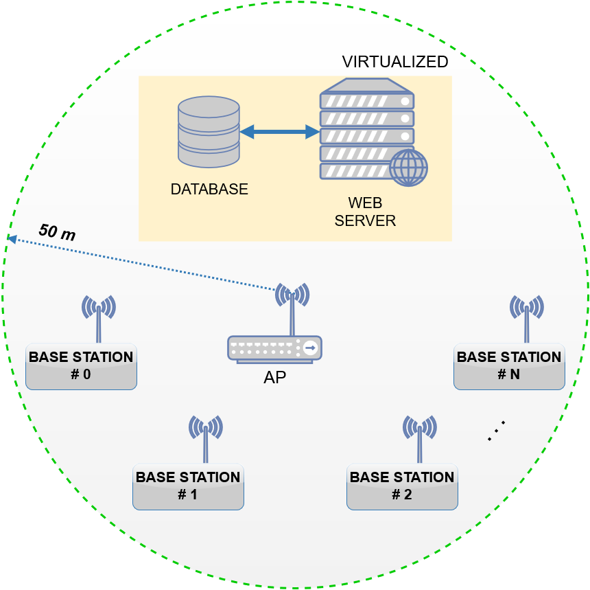

# Indoor Environmental Quality Analyzer (IEQA)

The I.E.Q.A. system consists of spatially distributed autonomous base stations equipped with sensors, LCD display, actuator, data storage device and a board that supports a Linux distribution with built-in WiFi support.
Every single base station is able to send their acquired/stored data over WiFi in a Wireless Local Area Network (WLAN) to a virtual Linux server which is aimed to process and display data through a dedicated web application. The latter, processes the data using a mathematical model based on the combination of two parameters: Heat Index (HI), which is obtained by multiple regression analysis by considering the values of temperature and relative humidity, and the Luminosity-Brightness Index (LBI) that provides an index based on the detected brightness according to [UNI EN 12464](http://store.uni.com/magento-1.4.0.1/index.php/uni-en-12464-1-2011.html) (released by the [Italian National Unification](http://www.uni.com)).

    </img>

For more details explore the following sections:

- [Main features](#main-features)
- [Network](#network)
- [Hardware](#hardware)
- [Firmware](./code/firmware)
- [Web application](./code/webapp)

## Main features

### Server

- *Dashboard*: shows in real time the relevant data using charts and tables to illustrate the most important informations;
- *Graphs*: shows in real time detailed graphs in order to analyze data;
- *Statistics*: shows in real time statistics, boxplots and graphs to make statistical analysis of data;
- *Report*: uses the processed data to print statistical report;
- *Options*: allows to edit/apply various option (see functionalities for the user).

### User

- *Empty the table*: allows to truncate through a SQL query of the database table which contains the all acquired values;
- *Set the sampling rate*: allows to set the time interval between two consecutive acquisitions on the desired base station/s;
- *Set the alarm thresholds*: allows to set the alarm thresholds for each sensor (e.g., temperature, relative humidity, and brightness/luminosity) on the desired base station/s.

### Base station

- *Connection*: each BS is able to automatically connect to the WLAN network with a static IP;
- *Time synchronization*: the device can synchronize its clock time with the server;
- *Storage device*: in offline mode the acquired data are stored into a microSD card. Then, as soon as the connection has been re-established, the saved data will be automatically sent to the server;
- *Programmable*: it is possible to edit the firmware code setting different alarm thresholds and sampling rate directly from the server;
- *Actuator*: each BS has been predisposed to easily drive an actuator;
- *Self-diagnostic*: the device can easily identify when a fault has occurred.
- *LCD and Reset*: each BS has endowed with a reset button and a display with backlight that shows all informations about the system.

## Network

### Network configuration
The following table illustrates an example of network configuration of the whole system implemented using two base stations.

|                   |      BS #0      |      BS #1      |       Host      |   Virtual web   |
|-------------------|:---------------:|:---------------:|:---------------:|:---------------:|
| **Address**       |  192.168.43.10  |  192.168.43.20  |  192.168.43.61  |  192.168.43.100 |
| **Netmask**       |  255.255.255.0  |  255.255.255.0  |  255.255.255.0  |  255.255.255.0  |
| **Wildcard mask** |    0.0.0.255    |    0.0.0.255    |    0.0.0.255    |    0.0.0.255    |
| **Network**       | 192.168.43.0/24 | 192.168.43.0/24 | 192.168.43.0/24 | 192.168.43.0/24 |
| **Broadcast**     |  192.168.43.255 |  192.168.43.255 |  192.168.43.255 |  192.168.43.255 |
| **Gateway**       |   192.168.43.1  |   192.168.43.1  |   192.168.43.1  |   192.168.43.1  |

    </img>

In this case, the system is composed of 4 hosts, leaving space for another 249 hosts.

**NOTE**:  in order to allow the *handover* between nodes (or devices) and WLAN, it is possible to use multiple access points (APs).

### Communication

Each base station has built-in WiFi module that supports IEEE 802.11 b/g/n standard compliant 2.4 GHz as described in the table (supporting WEP, WPA, and WPA2 encryption).

|   Standard   | Frequency | Bandwidth | Modulation | Range (approx.) |
|:------------:|:---------:|:---------:|:----------:|:---------------:|
| **802.11 b** |  2.4 GHz  |   22 MHz  |    DSSS    |       35 m      |
| **802.11 g** |  2.4 GHz  |   20 MHz  |    OFDM    |       35 m      |
| **802.11 n** |  2.4 GHz  |   20 MHz  |  MIMO-OFDM |       70 m      |

In order to achieve a better interoperability, reliability, scalability, and fast performance, the client/server communication takes place in accordance with the **RE**presentational **S**tate **T**ransfer (REST) architectural style. Thus, the standard communication protocol used to share informations and data, is the Hypertext Transfer Protocol (HTTP) making use of the following two methods:

- **HTTP GET method** requests a representation of the specified resource. Requests using GET should only retrieve data and should have no other effect. This method is used by the base stations to get the updated values of alarm thresholds and sampling rate or to syncronize the clock of the Linino kernel with the server.
- **HTTP POST method** requests that the server accept the entity enclosed in the request as a new subordinate of the web resource identified by the URI. This method is used by the base stations to post data (acquired or stored into the microSD card) to the server.

All data are formatted in JSON format, which vary depending on the method used.

### Server virtualization

The dynamic web application has been developed making use of the LAMP (Linux, Apache, MySQL, PHP) stack on a Debian-based Linux operating system with no GUI, which has been virtualized using the [Oracle VirtualBox](https://www.virtualbox.org/) platform (a cross-platform virtualization application). The connection mode has been set to *bridged network*, so Oracle VM VirtualBox connects to one of the installed network cards and exchanges network packets directly, circumventing the host operating system's network stack.

#### Bridged Networking

With bridged networking, VirtualBox uses a device driver on the host system that filters data from the physical network adapter. This driver is therefore called a "net filter" driver and it allows VirtualBox to intercept data from the physical network and inject data into it, effectively creating a new network interface in software. When the guest is using such a new software interface, it looks to the host system as though the guest were physically connected to the interface using a network cable: the host can send data to the guest through that interface and receive data from it. From the following screenshots it can be seen the network settings of the server on VirtualBox and the network configuration detected on the Host.

    </img>

## Hardware

### List (with a brief description) of the hardware components

- *Arduino Yún*

  The Arduino Yún is the core of the base station and it consists of a microcontroller board based on the ATmega32u4 and the Atheros AR9331. The Atheros processor supports a Linux distribution based on OpenWrt named OpenWrt-Yun. The board has built-in Ethernet and WiFi support, a USB-A port, micro-SD card slot, 20 digital input/output pins (of which 7 can be used as PWM outputs and 12 as analog inputs), a 16 MHz crystal oscillator, a micro USB connection, an ICSP header, and a 3 reset buttons. The Yún distinguishes itself from other Arduino boards in that it can communicate with the Linux distribution onboard, offering a powerful networked computer. For more details see [Arduino website](https://www.arduino.cc/).

- *Luminosity sensor TSL2561*

  The TSL2561 luminosity sensor is an advanced I2C digital light sensor equipped with both infrared and full-spectrum diodes allowing for exact illuminance calculation. This sensor is very precise and can be configured for different gain/timing ranges to detect light ranges from up to 0.1-40000+ Lux on the fly. The current draw is extremely low, so its great for low power data-logging systems, about 0.5 mA when actively sensing, and less than 15 uA when in powerdown mode. For more details see [Adafruit website](https://www.adafruit.com/).

- *Humidity and Temperature sensor HTU21D-F*

  This is an I2C digital device with dedicated humidity and temperature transducers for applications where reliable and accurate measurements are needed. The temperature output has an accuracy of ±1°C from -30∼90°C. This low power sensor is designed for high volume and cost sensitive applications with tight space constraints and it works with any kind of microcontroller with 3.3V-5V power or logic. For more details see [Adafruit website](https://www.adafruit.com/).

- *16x4 LCD blue backlight*

  This is a 16x4 character LCD with white text on a vivid blue background. Moreover, the single LED backlight included can be dimmed with a resistor (or PWM). This device has a compatible Hitachi HD44780 driver and can be fully controlled with only 6 digital lines. The LCD reports the operating conditions of the system, such as id station number, temperature, relative humidity, luminosity, and connection status.

### Schematic of the base station and prototype

    </img>

    </img>

## License

This project is licensed under the MIT License - see the [LICENSE](LICENSE) file for details.
