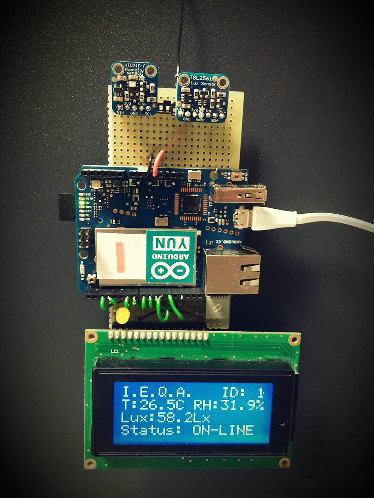

    

# Indoor Environmental Quality Analyzer (IEQA)

The I.E.Q.A. system consists of spatially distributed autonomous base stations equipped with sensors, an LCD display, an actuator, a data storage device, and a board that supports a Linux distribution with built-in WiFi support. Each base station is capable of sending its acquired and stored data over WiFi in a Wireless Local Area Network (WLAN) to a virtual Linux server that is designed to process and display data through a dedicated web application. This application processes the data using a mathematical model based on the combination of two parameters: the Heat Index (HI), obtained through multiple regression analysis considering temperature and relative humidity, and the Luminosity-Brightness Index (LBI), which provides an index based on the detected brightness according to UNI EN 12464 (released by the [Italian National Unification](http://www.uni.com)).

    

For more details explore the following sections:

- [Main features](#main-features)
- [Network](#network)
- [Hardware](#hardware)
- [Firmware](./code/firmware)
- [Web application](./code/webapp)

## Main features

### Server

- _Dashboard_: displays relevant data in real time using charts and tables to illustrate the most important information.
- _Graphs_: shows detailed graphs in real time for data analysis.
- _Statistics_: provides real-time statistics, box plots, and graphs for statistical analysis of data.
- _Report_: uses the processed data to generate a statistical report.
- _Options_: allows users to edit and apply various settings (see functionalities for the user).

### User

- _Empty the table_: allows truncation of the database table containing all acquired values via a SQL query.
- _Set the sampling rate_: enables the user to specify the time interval between two consecutive acquisitions for the desired base station(s).
- _Set the alarm thresholds_: permits the user to establish alarm thresholds for each sensor (e.g., temperature, relative humidity, and brightness/luminosity) on the desired base station(s).

### Base station

- _Connection_: each base station can automatically connect to the WLAN network with a static IP address.
- _Time synchronization_: the device can synchronize its clock with the server.
- _Storage device_: in offline mode, acquired data is stored on a microSD card. Once the connection is re-established, the saved data will be automatically sent to the server.
- _Programmable_: the firmware code can be edited to set different alarm thresholds and sampling rates directly from the server.
- _Actuator_: each base station is designed to easily drive an actuator.
- _Self-diagnostic_: the device can identify when a fault has occurred.
- _LCD and Reset_: each base station is equipped with a reset button and a backlit display that shows all system information.

## Network

### Network configuration

The following table illustrates an example of network configuration of the whole system implemented using two base stations.

|                   |      BS #0      |      BS #1      |      Host       |   Virtual web   |
| ----------------- | :-------------: | :-------------: | :-------------: | :-------------: |
| **Address**       |  192.168.43.10  |  192.168.43.20  |  192.168.43.61  | 192.168.43.100  |
| **Netmask**       |  255.255.255.0  |  255.255.255.0  |  255.255.255.0  |  255.255.255.0  |
| **Wildcard mask** |    0.0.0.255    |    0.0.0.255    |    0.0.0.255    |    0.0.0.255    |
| **Network**       | 192.168.43.0/24 | 192.168.43.0/24 | 192.168.43.0/24 | 192.168.43.0/24 |
| **Broadcast**     | 192.168.43.255  | 192.168.43.255  | 192.168.43.255  | 192.168.43.255  |
| **Gateway**       |  192.168.43.1   |  192.168.43.1   |  192.168.43.1   |  192.168.43.1   |

    

In this case, the system is composed of 4 hosts, leaving space for another 249 hosts.

**NOTE**: in order to allow the _handover_ between nodes (or devices) and WLAN, it is possible to use multiple access points (APs).

### Communication

Each base station has a built-in WiFi module that supports the IEEE 802.11 b/g/n standard compliant with 2.4 GHz, as described in the table (supporting WEP, WPA, and WPA2 encryption).

|   Standard   | Frequency | Bandwidth | Modulation | Range (approx.) |
| :----------: | :-------: | :-------: | :--------: | :-------------: |
| **802.11 b** |  2.4 GHz  |  22 MHz   |    DSSS    |      35 m       |
| **802.11 g** |  2.4 GHz  |  20 MHz   |    OFDM    |      35 m       |
| **802.11 n** |  2.4 GHz  |  20 MHz   | MIMO-OFDM  |      70 m       |

To achieve better interoperability, reliability, scalability, and fast performance, client/server communication follows the **RE**presentational **S**tate **T**ransfer (REST) architectural style. The standard communication protocol used for sharing information and data is the Hypertext Transfer Protocol (HTTP), which employs the following two methods:

- **HTTP GET method**: requests a representation of the specified resource. Requests using GET should only retrieve data and have no other effect. This method is used by the base stations to obtain updated values for alarm thresholds and sampling rates or to synchronize the clock of the Linino kernel with the server.
- **HTTP POST method** requests that the server accept the entity enclosed in the request as a new subordinate of the web resource identified by the URI. This method is used by the base stations to send data (either acquired or stored on the microSD card) to the server.

All data is formatted in JSON format, which varies depending on the method used.

### Server virtualization

The dynamic web application has been developed using the LAMP (Linux, Apache, MySQL, PHP) stack on a Debian-based Linux operating system without a GUI. This setup has been virtualized using the [Oracle VirtualBox](https://www.virtualbox.org/) platform, a cross-platform virtualization application. The connection mode has been set to _bridged network_, allowing Oracle VM VirtualBox to connect to one of the installed network cards and exchange network packets directly, circumventing the host operating system's network stack.

#### Bridged Networking

With bridged networking, VirtualBox employs a device driver on the host system that filters data from the physical network adapter. This driver is referred to as a "net filter" driver, allowing VirtualBox to intercept data from the physical network and inject data into it, effectively creating a new software-based network interface. When the guest operates using this new software interface, it appears to the host system as if the guest were physically connected to the interface via a network cable; the host can send data to the guest through that interface and receive data from it. The following screenshots illustrate the network settings of the server in VirtualBox and the network configuration detected on the host.

    

## Hardware

### List (with a brief description) of the hardware components

- _Arduino Yún_

  The Arduino Yún serves as the core of the base station and consists of a microcontroller board based on the ATmega32u4 and the Atheros AR9331. The Atheros processor supports a Linux distribution called OpenWrt-Yun, which is based on OpenWrt. The board includes built-in Ethernet and WiFi support, a USB-A port, a micro-SD card slot, 20 digital input/output pins (of which 7 can function as PWM outputs and 12 as analog inputs), a 16 MHz crystal oscillator, a micro USB connection, an ICSP header, and three reset buttons. The Yún differentiates itself from other Arduino boards by enabling communication with the onboard Linux distribution, thus functioning as a powerful networked computer. For more details see [Arduino website](https://www.arduino.cc/).

- _Luminosity sensor TSL2561_

  The TSL2561 luminosity sensor is an advanced I2C digital light sensor equipped with both infrared and full-spectrum diodes, allowing for precise illuminance calculations. This sensor is highly accurate and can be configured for various gain and timing ranges, enabling it to detect light levels from 0.1 to over 40,000 Lux in real-time. Its current draw is extremely low, making it ideal for low-power data-logging systems, consuming approximately 0.5 mA during active sensing and less than 15 µA in power-down mode. For more details see [Adafruit website](https://www.adafruit.com/).

- _Humidity and Temperature sensor HTU21D-F_

  This is an I2C digital device featuring dedicated humidity and temperature transducers for applications requiring reliable and accurate measurements. The temperature output has an accuracy of $\pm 1$°C within the range of -30 to 90°C. Designed for low power consumption, this sensor is suitable for high-volume, cost-sensitive applications with tight space constraints and is compatible with any microcontroller that operates on 3.3V to 5V power or logic levels. For more details see [Adafruit website](https://www.adafruit.com/).

- _16x4 LCD blue backlight_

  This is a 16x4 character LCD featuring white text on a vivid blue background. Additionally, the single LED backlight can be dimmed using a resistor or PWM. The device is compatible with the Hitachi HD44780 driver and can be fully controlled with just 6 digital lines. The LCD displays the operating conditions of the system, including the station number, temperature, relative humidity, luminosity, and connection status.

### Schematic of the base station and prototype

    

    

 

For more details explore the code:

- [Firmware](./code/firmware);
- [Web application](./code/webapp).

## License

This project is licensed under the MIT License - see the [LICENSE](LICENSE) file for details.
