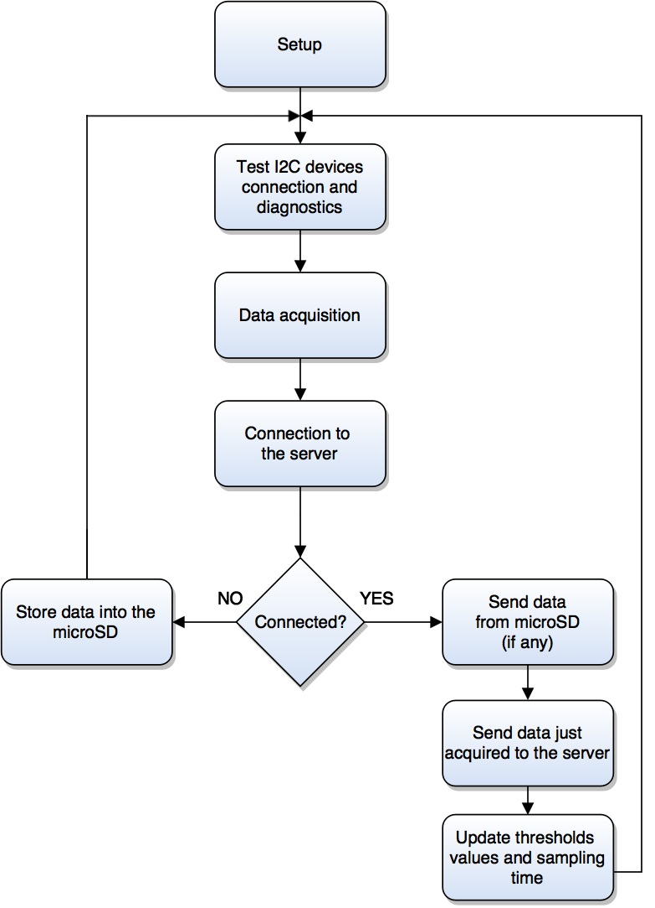

# Firmware

In this section you can find a brief explanation of the Arduino Yún architecture and some technical specs (for more details see [Arduino website](https://www.arduino.cc/)), the structure of the firmware, the libraries used by the board to work properly, and the main functions implemented.

**Note**: even though the firmware has not been described in detail, the code is commented enough to be easily understood.

## Arduino Yún architecture and technical specs

In order to better understand how the board works, is reported a figure which sums up its internal architecture.

<div align="center">
    
</div>

The Bridge library facilitates communication between the two processors, giving Arduino sketches the ability to run shell scripts, communicate with network interfaces, and receive information from the AR9331 processor. The USB host, network interfaces and SD card are connected to the Atheros AR9331 and the Bridge library enables the Arduino to interface with those peripherals.

| AVR Arduino Yún microcontroller |                                                                                              | Linux microprocessor |                                                                                   |
|---------------------------------|----------------------------------------------------------------------------------------------|----------------------|-----------------------------------------------------------------------------------|
| Microcontroller                 | [ATmega32u4](http://www.atmel.com/Images/Atmel-7766-8-bit-AVR-ATmega16U4-32U4_Datasheet.pdf) | Processor            | [Atheros AR9331](https://www.openhacks.com/uploadsproductos/ar9331_datasheet.pdf) |
| Operating Voltage               | 5 V                                                                                          | Architecture         | MIPS @400MHz                                                                      |
| Input Voltage                   | 5 V                                                                                          | Operating Voltage    | 3.3 V                                                                             |
| Digital I/O Pins                | 20                                                                                           | Ethernet             | IEEE 802.3 10/100 Mbit/s                                                          |
| PWM Channels                    | 7                                                                                            | WiFi                 | IEEE 802.11 b/g/n                                                                 |
| Analog Input Pins               | 12                                                                                           | USB Type-A           | 2.0 Host                                                                          |
| DC Current per I/O Pin          | 40 mA                                                                                        | Card Reader          | microSD only                                                                      |
| DC Current for 3.3V Pin         | 50 mA                                                                                        | RAM                  | 64 MB DDR2                                                                        |
| Flash Memory                    | 32 KB (of which 4 KB used by bootloader)                                                     | Flash Memory         | 16 MB                                                                             |
| SRAM                            | 2.5 KB                                                                                       | SRAM                 | 2.5 KB                                                                            |
| EEPROM                          | 1 KB                                                                                         | EEPROM               | 1 KB                                                                              |
| Clock Speed                     | 16 MHz                                                                                       | Clock Speed          | 16 MHz                                                                            |

## Structure of the firmware

There are two special functions that are a part of every Arduino sketch: `setup()` and `loop()`. The `setup()` is called once, when the sketch starts. The `loop()` function is called over and over and is heart of the sketch.

- **Setup routine**

<div align="center">
    
</div>

- **Loop routine**

<div align="center">
    
</div>

### Libraries

- `Bridge.h`

  This library allows the communication between the two processors previously described. Several classes of this library are used, such as:
  - `FileIO.h` used for read/write files on the microSD card;
  - `Mailbox.h` which is an asynchronous, sessionless interface for communicating between Linux and Arduino;
  - `Process.h` is used to launch processes on the Linux processor, and other things like shell scripts;
  - `YunClient.h` which is an Arduino based HTTP client;
  - `YunServer.h` which is an Arduino based HTTP server.

- `LiquidCrystal.h`

  This library allows the board to control the Liquid Crystal Display (LCD) based on the Hitachi HD44780 chipset using 4-bit mode (4 data lines in addition to the rs, enable, and the rw control lines).

- `avr/pgmspace.h`

  This library is available in the AVR architecture only and it allows the board to store data (constants) in flash (program) memory instead of SRAM (flash PROGMEM memory can only be populated at program burn time and it is not possible to change the values in the flash after the program has started running).

- `Wire.h`

  This library allows the board to communicate with I2C/TWI devices, in particular the SDA (data line) and SCL (clock line) are on the pin 2 and 3 respectively.

- `TSL2561.h`

  The TSL2561 is a 16-bit digital (I2C) light sensor, with adjustable gain and 'integration time' (set to 16x gain for dim environment with a medium integration time). This library allows the board to communicate with the sensor via I2C bus (address 0x39) to calculate the Lux value.

- `HTU21DF.h`

  The HTU21D-F is a 16-bit digital (I2C) humidity and temperature sensor. This library allows the board to communicate with the sensor via I2C bus (address 0x40) and to read sensor data.

### Main functions implemented

To better understand the main functions described below, it is reported a list of the main constants and global variables.

```cpp
...

/** Constants */
const short LCD_WIDTH  PROGMEM = 16;   // Maximum characters per line
const short LCD_HEIGHT PROGMEM =  4;   // Maximum height
const short SENSORS    PROGMEM =  3;   // Number of sensors
const short ITER       PROGMEM =  5;   // Number of iterations
const short ACTUATOR   PROGMEM =  6;   // Pin which is connected to the actuator
const short LEDr       PROGMEM = 13;   // On-board LED
const short BOARD_ID   PROGMEM =  0;   // Board ID

/* Default threshold values and sampling time */
const short TX_TIME  PROGMEM = 15000;  // Interval between loop routines
const short TEMP_MAX PROGMEM =    27;  // Maximum temperature
const short TEMP_MIN PROGMEM =    18;  // Minimum temperature
const short RH_MAX   PROGMEM =    70;  // Maximum humidity
const short LUX_MIN  PROGMEM =   100;  // Minimum lux

// For more details see /etc/config/network on the boards
#define IP_BOARD "192.168.43.10"
#define FILENAME "/mnt/sd/datalog.txt"

...

/** Global variables */
float s[SENSORS];                           // Data vector
HTU21DF htu = HTU21DF();                    // Create a HTU21DF object
TSL2561 tsl(TSL2561_ADDR_FLOAT);            // Create a TSL2561 object
LiquidCrystal lcd(7, 8, 9, 10, 11, 12);     // Initialize the library with the numbers of the interface pins
IPAddress server(192,168,43,100);           // IP address of the server
YunClient client;                           // Cunstructor for the client
bool connection;                            // Status of the connection
short config;                               // Configuration status of the sensors

/* Threshold values and sampling time */
unsigned long threshold[5] = { TEMP_MIN, TEMP_MAX, RH_MAX, LUX_MIN, TX_TIME };

...
```

- `alarm`

  A typical approach is to use an ON/OFF control action that turns the output ON or OFF based on a threshold point. However, due to small amounts of noise or temperature fluctuations near the threshold point, the output will turn ON and OFF frequently (also known as **chattering**). Thus, to prevent this from happening, a temperature band (**hysteresis**) is created between the ON and OFF operations.
  Then, an actuator is enabled/disabled as follows: when the input is higher than a chosen threshold, the output will be enabled, whereas when the input is below a different (lower) calculated threshold the output will be disabled. When the input is between the two levels, the output retains its status (see the figure below).

<div align="center">
    
</div>

- `data_acquisition`

  This function calculates the average of N consecutive acquired values (for stability) for each sensor, thus the values are concatenated into a string as follows: `data = "s0=xx.xx&s1=xx.xx&s2=xx.xx&board=X&time=xxxxxxxxxxx"`, where the time is given by the `get_time` function (described below).

- `get_data`

  This function allows the board to retrieve information from the server using the HTTP GET request in order to edit the threshold values and sampling time. The format of the GET request is as follows:

  ```
  "GET /ieqa/" + method + BOARD_ID + "HTTP/1.1"
  "Host: " + IPAddress
  "User-Agent: Arduino/1.0"
  "Connection: close"
  ```

  where *method* is a string that identifies what needed by the board, e.g. could be "get_time/" to synchronize the clock with the server, or "get_threshold_values/" to update the threshold values.

- `get_time`

  The function returns the timestamp by launching a process which execute the following linux (Linino) shell command: `"date +%FT%T" (whose output is yyyy-mm-ddThh:mm:ss)`.

- `I2C_devices_init`

  The function initializes the communication on I2C bus for all I2C devices (luminosity sensor on address 0x39 and the temperature and humidity sensor on address 0x40).

- `I2C_devices_test`

  Function that tests the I2C devices: the function returns 0 if the devices work properly, otherwise it returns 1 if it has been detected a fault on the TSL2561 sensor, 2 if it has been detected a fault on the HTU21DF sensor, or 3 if both sensors don't work properly.

- `network_connection`

  The function make a connection attempt to the target IP address passed as parameter and it returns 1 if the connection has been successfully established, otherwise it returns 0.

- `network_test`

  Function that tests the network connection: if the server is disconnectedit returns 1, otherwise it returns 0.

- `post_data`

  Similar to the previous function `get_data` with the difference that this function posts the data enclosed in the body of the request message to the server. The format of the POST request is as follows:

  ```
  "POST /ieqa/insert_data HTTP/1.1"
  "Host: " + IPAddress
  "User-Agent: Arduino/1.0"
  "Connection: " + method
  "Content-Type: application/x-www-form-urlencoded;"
  "Content-length: " + data.length()
  data
  ```

  where *method* is a string that identifies the type of connection (e.g., *close* or *keep-alive*), data.length() is the length of the data acquired, and data is a string with the data to post.

- `send_from_microSD`

  Function that sends data stored into microSD (path: `"/mnt/sd/datalog.txt"`) to the server (using the `post_data` function with `method = "close"`). When the data are sent, the function removes the file stored into the microSD card.

- `send_to_server`

  Function that syncronizes the internal clock of the Linino side with the server executing the following shell command: `"date --set '" + server_clock + "'"`, where `server_clock` contains the time clock of the server.

- `set_data_from_server`

  Function that gets data (thresholds or sampling time) from server by using `get_data` function and it modifies the relative values.

- `store_into_microSD`

  Function that stores the acquired data into the microSD (path: `"mnt/sd/datalog.txt"`). Each entry in the file is equivalent to a string of 51 bytes which identifies the values acquired by the base station, the acquisition time, and the identification number of the base station itself. Given for instance a microSD card of just 1 GB, it is possible to store: 1 GB / 51 B = 21053761 entries. Thus, considering the maximum sampling rate (minimum sampling time) it is possible to store 121 months of acquisitions with a sampling time of 15 s.
