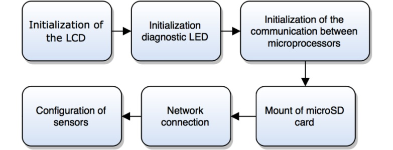

# Firmware

In this section you can find a brief explanation of the Arduino Yún architecture and some technical specs (for more details see [Arduino website](https://www.arduino.cc/)), the structure of the firmware, the libraries used by the board to work properly, and the main functions implemented.

**Note**: even though the firmware has not described in detail, the code is commented enough to be easily understood.

## Arduino Yún architecture and technical specs

In order to better understand how the board works, is reported a figure which sums up its internal architecture.

    </img>

The Bridge library facilitates communication between the two processors, giving Arduino sketches the ability to run shell scripts, communicate with network interfaces, and receive information from the AR9331 processor. The USB host, network interfaces and SD card are connected to the Atheros AR9331 and the Bridge library enables the Arduino to interface with those peripherals.

| AVR Arduino Yún microcontroller |                                                                                              | Linux microprocessor |                                                                                   |
|---------------------------------|----------------------------------------------------------------------------------------------|----------------------|-----------------------------------------------------------------------------------|
| Microcontroller                 | [ATmega32u4](http://www.atmel.com/Images/Atmel-7766-8-bit-AVR-ATmega16U4-32U4_Datasheet.pdf) | Processor            | [Atheros AR9331](https://www.openhacks.com/uploadsproductos/ar9331_datasheet.pdf) |
| Operating Voltage               | 5 V                                                                                          | Architecture         | MIPS @400MHz                                                                      |
| Input Voltage                   | 5 V                                                                                          | Operating Voltage    | 3.3 V                                                                             |
| Digital I/O Pins                | 20                                                                                           | Ethernet             | IEEE 802.3 10/100 Mbit/s                                                          |
| PWM Channels                    | 7                                                                                            | WiFi                 | IEEE 802.11 b/g/n                                                                 |
| Analog Input Pins               | 12                                                                                           | USB Type-A           | 2.0 Host                                                                          |
| DC Current per I/O Pin          | 40 mA                                                                                        | Card Reader          | microSD only                                                                      |
| DC Current for 3.3V Pin         | 50 mA                                                                                        | RAM                  | 64 MB DDR2                                                                        |
| Flash Memory                    | 32 KB (of which 4 KB used by bootloader)                                                     | Flash Memory         | 16 MB                                                                             |
| SRAM                            | 2.5 KB                                                                                       | SRAM                 | 2.5 KB                                                                            |
| EEPROM                          | 1 KB                                                                                         | EEPROM               | 1 KB                                                                              |
| Clock Speed                     | 16 MHz                                                                                       | Clock Speed          | 16 MHz                                                                            |

## Structure of the firmware

There are two special functions that are a part of every Arduino sketch: `setup()` and `loop()`. The `setup()` is called once, when the sketch starts. The `loop()` function is called over and over and is heart of the sketch.

- **Setup routine**

    </img>

- **Loop routine**

    </img>

### Libraries

- `Bridge.h`
