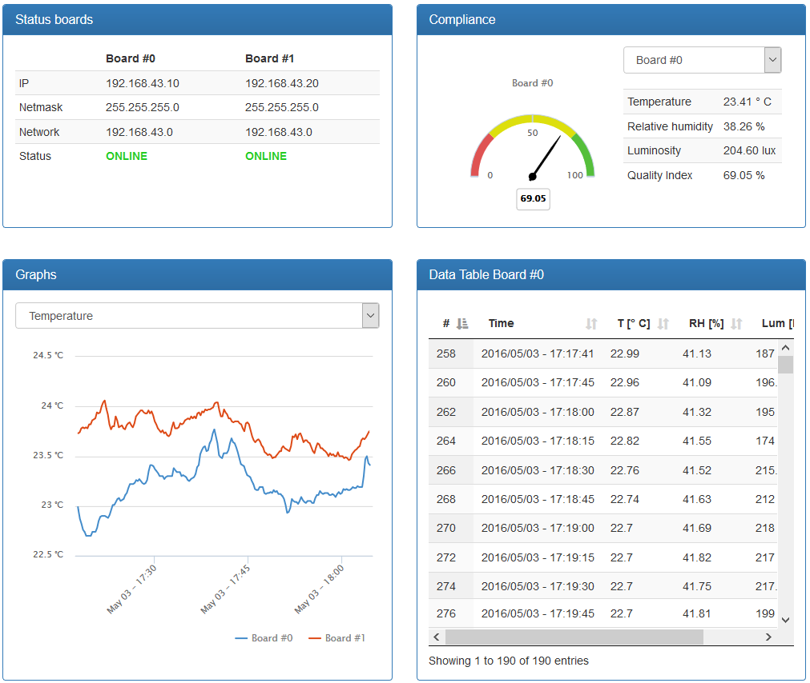

# Web application

<!-- In this section you can find a brief explanation of the software architectural pattern, the mathematical model used to calculate the quality index, and the main functions implemented. -->

The application software runs on a virtual Linux distribution (ubuntu server with LAMP web service solution stack *properly configured*) is based on a software architectural pattern named **Model-View-Controller** (MVC) implemented on the [CodeIgniter Web Framework](https://www.codeigniter.com/).
Thus, it has been created a Controller, a Model, and some Views, as well as the database1 to hold the information.

1 *Current supported ones are MySQL (5.1+), MySQLi, Oracle, Postgres, MS SQL, SQLite, CUBRID, Interbase/Firebird and ODBC.*

## Database

The database requirements are as follows:

- a table called *sensors* which contains 6 columns: **id** (primary and auto incremented), **timestamp** (timestamp of the acquistion), **s0** (acquired value of temperature), **s1** (acquired value of relative humidity), **s2** (acquired value of brightness/luminosity), **board** (id of the board which have sent data).

| Name          | Type    | Length | Default | Attributes | Auto increment | Comments              |
|---------------|---------|--------|---------|------------|----------------|-----------------------|
| **id**        | INT     | 5      | None    | unsigned   | Yes            | primary key           |
| **timestamp** | INT     | 15     | None    | unsigned   | No             | time                  |
| **s0**        | DECIMAL | 6,3    | None    | unsigned   | No             | temperature [Celsius] |
| **s1**        | DECIMAL | 6,3    | None    | unsigned   | No             | relative humidity [%] |
| **s2**        | DECIMAL | 6,3    | None    | unsigned   | No             | luminosity [lux]      |
| **board**     | INT     | 1      | None    | unsigned   | No             | board id              |

- a table called *thresholds* which contains 6 columns: **board** (unique id of the board), **t0** (minimum temperature threshold value of the board), **t1** (maximum temperature threshold value of the board), **t2** (maximum relative humidity threshold value of the board), **t3** (minimum luminosity threshold value of the board), **t4** (sampling time of the board).

| Name      | Type    | Length | Default | Attributes | Auto increment | Comments                   |
|-----------|---------|--------|---------|------------|----------------|----------------------------|
| **board** | INT     | 1      | None    | unsigned   | No             | unique key                 |
| **t0**    | DECIMAL | 6,3    | None    | unsigned   | No             | min. temperature [Celsius] |
| **t1**    | DECIMAL | 6,3    | None    | unsigned   | No             | max. temperature [Celsius] |
| **t2**    | DECIMAL | 6,3    | None    | unsigned   | No             | max. relative humidity [%] |
| **t3**    | DECIMAL | 6,3    | None    | unsigned   | No             | min. luminosity [lux]      |
| **t4**    | INT     | 10     | None    | unsigned   | No             | sampling time              |

**NOTE**: Before the model implementation, it is necessary to tell CodeIgniter Web Framework which database to use and how to access it editing the relative configuration file (according to the informations used in the configuration setup of the LAMP web service).

## The Model-View-Controller (MVC) pattern

The MVC pattern is a layered architecture implemented on a web framework (CodeIgniter) which divides a given software application into three interconnected parts, so as to separate internal representations of information from the ways that information is presented to or accepted by the user. This means that each layer can focus solely on its role.

The three parts of the MVC are the follows:

1. **Model**: the first module captures the behavior of the application in terms of its problem domain, independent of the user interface. It directly manages the "knowledge", i.e., data, and the application's logic.
2. **View**: the second module implements visual representation of the model (user interface), including the logic to display data to the user and handle user interaction with the application.
3. **Controller**: the last module is the (conceptual) link between the user and the system, it manages the user input and instructs the views for answering the user's request.

    </img>

### Architecture

The following graphic illustrates how data flows throughout the system (**MVC implementation in CodeIgniter**):

- index.php is a generic (external) controller: it initializes the resources needed by CI;
- the router examines the HTTP request and decides which controller should serve it (if the response to the current request is present in a cache, it will be immediately emitted);
- the HTTP request is filtered by the security module before sending it to the application controller;
- the controller loads the resources needed for processing the request and (possibly) instructs the model accordingly;
- the view is invoked for generating the content to be returned to the browser (possibly, this content is stored in the cache).

The overall framework is organized as follows (only directories):

| **application** | cache, config, controllers, core, errors, helpers, hooks, language, libraries, logs, models, views  |
|----------------:|:--------------------------------------------------------------------------------------------------------------------------------------------|
|      **assets** | css, fonts, js                                                                                                                              |
|      **system** | core, database, fonts, helpers, language, libraries                                                                                         |

while the MVC architecture is organized as follows:

|      **MODEL** | sensors.php                                                                                                     |
|---------------:|:--------------------------------------------------------------------------------------------------------------------------------------------------------|
| **CONTROLLER** | ieqa.php                                                                                                                                                |
|      **VIEWS** | analytics.php, dashboard.php, db_empty.php, error.php, footer.php, graphs.php, header.php, home.php, info.php, options.php, report.php, statistics.php  |

    </img>

### The model

Model is the place where it is possible to retrieve/insert/update information in the database or other data stores, thus it has to do with connecting to the database in order to performing Create, Read, Update and Delete operations. Model and controller contain an uppercased constructor, which bears the same name as the page itself. The model has its own functions which can be called as soon as a specific instance of the given model has been created.

A list of the methods implemented in the model follows:

- `__construct()`: constructor method which loads the database;
- `is_not_empty($table)`: it returns 1 if the query to the database table passed as parameter returns a number of entries greater than 0 (in other words if is not empty);
- `get_all()`: it makes a query to the database in order to return all the informations in the "sensors" table for both the boards;
- `get_json_table($board)`: similar to the above method but it returns the data in JSON format and for a specific board;
- `get_json_graphs($board)`: it returns in JSON format all the informations to implements graphs for a specific board;
- `get_json_statistics($par)`: it returns in JSON format all the statistics (minimum, maximum, expected value, variance, standard deviation, coefficient of variation, lower quartile, median, upper quartile and interquartile range) about a specific sensor passed as parameter for both the boards;
- `get_thresholds($board)`: it returns in JSON format the threshold values stored in the database table `thresholds` for the selected board. If there isn't an entry in the table for the selected board, then the method returns the default threshold values;
- `insert_data_into_db()`: it inserts data posted by the boards (i.e. temperature, relative humidity, luminosity and timestamp), into the database for the selected board (making use of HTTP POST method);
- `make_report($temp, $rh, $lux)`: it generates the report in HTML code with statistics, boxplots, network configuration etc. elaborating the JSON data of each sensor contained into the variables passed as parameters;
- `update_samp_time()`: it updates the sampling time into the database for the selected board (making use of HTTP POST method), in particular the method returns 1 if the sampling time of at least one board has been modified, otherwise it returns 0;
- `update_threshold_values()`: it updates the threshold values into the database for the selected board (making use of HTTP POST method), in particular the method returns 1 if at least one threshold value of a board has been modified, otherwise it returns 0.

### The controller

The controller's structure resembles that of the model but the controller connects the back end and the front end, hence it will call the methods inside the model to output what it needs to display to a view. All database-related functions in CodeIgniter are set and called using the model, the front end is displayed and managed by the view instead. In brief, the controller creates a new instance of the model, does certain functions and passes the results to the view so as to display them on the web browser.

A list of the methods implemented in the controller follows:

- ` __construct()`: constructor method which loads the model, URL Helper library (which contains functions that assist in working with URLs) and Sessions library (which allows to maintain a user's "state" and track their activity while they browse the website);
- `index()`: it loads the home page if the controller is invoked;
- `home()`: it loads the home view;
- `dashboard()`: it loads the dashboard view if the table is not empty2;
- `analytics()`: it loads the analytics view if the table is not empty2;
- `graphs()`: it loads the graphs view if the table is not empty2;
- `statistics()`: it loads the statistics view if the table is not empty2;
- `report()`: it loads the report view if the table is not empty2;
- `options()`: it loads the options view;
- `info()`: it loads the info view;
- `generate_report()`: it invokes the `get_json_statistics($par)` for each sensor and passes the returned JSON data to the method `make_report($temp, $rh, $lux)` in the model if the function has been called through a HTTP POST request3;
- `json_data_table($board)`: it calls the method `get_json_table($board)` in the model for a specific board;
- `json_data_graphs($board)`: it calls the method `get_json_graphs($board)` in the model for a specific board;
- `json_data_statistics($par)`: it calls the method `get_json_statistics($par)` in the model for a specific sensor;
- `edit_samp_time()`: it invokes the method `update_samp_time()` in the model if the function has been called through a HTTP POST request3;
- `edit_threshold_values()`: it invokes the method `update_threshold_values()` in the model if the function has been called through a HTTP POST request3;
- `empty_table()`: it performs a shrink operation through a `TRUNCATE` statement of the `sensors` table, as a result this operation quickly removes all data from the table3;
- `data_available($board)`: it returns 0 if there are no data available in the `sensors` table for the selected board;
- `ping($host)`: it performs a ping request to test the reachability of a specific host (e.g., a board). The function returns 1 if the target host send in response to the ICMP Echo Request an ICMP Echo Reply, otherwise returns 0;
- `get_time()`: it returns the unix timestamp of the server (used to synchronize the clocks between board and server)4;
- `get_threshold_values($board)`: it returns the alarm threshold values and sampling time (used to update the values of the boards)4;
- `insert_data()`: it invokes the method `insert_data_into_db()` in the model if the function has been called through a HTTP POST request3;

2 *The function loads the proper view if the query of the model method `is_not_empty('sensors')` returns 1 (the table is not empty), otherwise it loads the error view (no data available).*

3 *The function invokes the proper method if the HTTP request method is equal to POST, otherwise it loads the error view (this method cannot be invoked directly).*

4 *The function invokes the proper method if the HTTP request method is equal to GET, otherwise it loads the error view (this method cannot be invoked directly).*

### The views

Views get the data to display from the controller, who is responsible for fetching a particular view and passing the data to it as variables.
A view resembles a regular HTML page with doctype, head, and body tags, or a page fragment, like a header, footer, sidebar, etc. which can flexibly be embedded within other views.

A list of the main views follows:

- `dashboard()`: it uses charts and tables to illustrate the most important informations;

    </img>

- `graphs()`: it uses a graphic representation to perform time-series analysis;

    </img>

- `statistics()`: it uses statistics and graphs (i.e., box-and-whisker plots) to make statistical analysis of data;

    </img>

- `options()`: it allows a user to delete all the entries available in the database or to edit various options (e.g., threshold values and sampling rate) on a specific board.

    </img>

